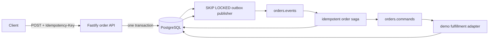

# Event Driven Order Platform

[](https://github.com/German4341374/event-driven-order-platform/actions/workflows/ci.yml)


A small order service where you can place an order, follow its progress, and see what happens
when payment or fulfillment fails. The demo lets you try successful orders and failure cases
without connecting to a real shop or payment provider.

The API uses Fastify, orders are stored in PostgreSQL, and workers exchange messages through
Redpanda. The useful part is seeing what happens when a message arrives twice or a worker
stops halfway through its work.

## Architecture



The order change and the message describing it are saved in the same PostgreSQL transaction.
A worker sends the message later. It may send it more than once, so consumers remember message
IDs and skip work they have already handled. See [how delivery works](docs/architecture.md).

## Things to try

- Send the same order request twice with one idempotency key. You should get one order.
- Follow an order through its saved timeline and look up the messages behind each step.
- Trigger an inventory or payment failure and watch the workflow handle it.
- Inspect the outbox: workers use `FOR UPDATE SKIP LOCKED` to share pending work.
- Check how order IDs keep related Kafka messages in the same partition.
- Read the consumer inbox to see which message IDs have already been processed.
- Try an update with an old version number and see it rejected instead of overwriting newer work.
- Inspect messages that have run out of retries in the dead-letter state.

Docker runs the app as a non-root user with a read-only filesystem. Health checks and shutdown
handling are included, and CI runs unit tests plus a Compose smoke test of the order workflow.

## Quick start

You'll need Docker Engine with Compose v2 and Node.js 24 to run the smoke script below.
The services run locally.

```bash
cp .env.example .env
docker compose up --build --detach --wait
node scripts/smoke.mjs
```

Swagger UI: `http://127.0.0.1:8080/docs`

Create an order manually:

```bash
curl --fail-with-body -X POST http://127.0.0.1:8080/api/orders \
  -H 'content-type: application/json' \
  -H 'idempotency-key: employer-demo-001' \
  -d '{"customerId":"customer-42","amountCents":4200,"simulation":"success"}'
```

Set `simulation` to `inventory_failure` or `payment_failure` to try a failed order.

## Local code checks

```bash
npm ci
npm run check
```

`npm run check` performs formatting verification, ESLint, strict type checking, unit tests with
coverage thresholds, and the production build. Docker Compose is required for the end-to-end saga
smoke test.

## Security decisions

- The example password is local-only and the data network is internal.
- No broker, database, or management endpoint is published beyond loopback.
- Request bodies are limited and validated; errors use a stable JSON envelope.
- Containers use `no-new-privileges`; the application runs as UID 10001 on a read-only filesystem.
- CI scans source, secrets, configuration, dependencies, and the Dockerfile.

## Limitations

- The fulfillment worker is deliberately deterministic and represents an external inventory and
  payment boundary; it is not a payment implementation.
- Redpanda is single-node and suitable only for local development.
- Outbox retention and automated replay approval are documented future work.
- Schema evolution uses one initial migration in this compact demonstration.

## Design questions

- Why a database transaction cannot atomically commit to Kafka without another protocol.
- How the outbox and consumer inbox produce at-least-once, duplicate-safe processing.
- Why correlation ID, causation ID, message ID, and aggregate version solve different problems.
- How `SKIP LOCKED`, Kafka keys, and optimistic locking address different concurrency boundaries.
- What happens when PostgreSQL, Redpanda, a publisher, or a consumer restarts mid-operation.

See [DEMO.md](DEMO.md), the [stalled order runbook](docs/runbooks/stalled-orders.md), and
[CONTRIBUTING.md](CONTRIBUTING.md).
