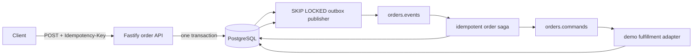

# Event Driven Order Platform

[](https://github.com/German4341374/event-driven-order-platform/actions/workflows/ci.yml)


A compact event-driven order workflow built to demonstrate distributed consistency, not CRUD
volume. It combines a Fastify API, PostgreSQL transactional outbox, Redpanda Kafka API, durable
saga decisions, idempotent consumers, optimistic locking, dead-letter handling, and structured
logs in one reproducible local environment.

## Architecture



The key design rule is simple: a business change and its outgoing message are committed together
in PostgreSQL. Kafka delivery is asynchronous and at least once. Consumers are idempotent by
message ID. See [architecture and delivery semantics](docs/architecture.md).

## Engineering features

- Idempotent order creation protected by a PostgreSQL advisory transaction lock.
- Transactional outbox with concurrent `FOR UPDATE SKIP LOCKED` publishers.
- Kafka partition ordering by order ID.
- Durable saga commands stored through the same outbox.
- Consumer inbox table keyed by consumer and message ID.
- Explicit state machine and optimistic version checks.
- Persisted order timeline and correlation/causation identifiers.
- Bounded publisher retry and queryable dead-letter state.
- Health probes, graceful shutdown, non-root image, read-only filesystem, and internal network.
- Unit coverage gates plus a real Compose workflow smoke test in GitHub Actions.

## Quick start

Requirements: Docker Engine with Compose v2. The demonstration is fully local.

```bash
cp .env.example .env
docker compose up --build --detach --wait
node scripts/smoke.mjs
```

Swagger UI: `http://127.0.0.1:8080/docs`

Create an order manually:

```bash
curl --fail-with-body -X POST http://127.0.0.1:8080/api/orders \
  -H 'content-type: application/json' \
  -H 'idempotency-key: employer-demo-001' \
  -d '{"customerId":"customer-42","amountCents":4200,"simulation":"success"}'
```

Use `inventory_failure` or `payment_failure` as `simulation` to demonstrate compensation paths.

## Local code checks

```bash
npm ci
npm run check
```

`npm run check` performs formatting verification, ESLint, strict type checking, unit tests with
coverage thresholds, and the production build. Docker Compose is required for the end-to-end saga
smoke test.

## Security decisions

- The example password is local-only and the data network is internal.
- No broker, database, or management endpoint is published beyond loopback.
- Request bodies are limited and validated; errors use a stable JSON envelope.
- Containers use `no-new-privileges`; the application runs as UID 10001 on a read-only filesystem.
- CI scans source, secrets, configuration, dependencies, and the Dockerfile.

## Limitations

- The fulfillment worker is deliberately deterministic and represents an external inventory and
  payment boundary; it is not a payment implementation.
- Redpanda is single-node and suitable only for local development.
- Outbox retention and automated replay approval are documented future work.
- Schema evolution uses one initial migration in this compact demonstration.

## Interview talking points

- Why a database transaction cannot atomically commit to Kafka without another protocol.
- How the outbox and consumer inbox produce at-least-once, duplicate-safe processing.
- Why correlation ID, causation ID, message ID, and aggregate version solve different problems.
- How `SKIP LOCKED`, Kafka keys, and optimistic locking address different concurrency boundaries.
- What happens when PostgreSQL, Redpanda, a publisher, or a consumer restarts mid-operation.

See [DEMO.md](DEMO.md), the [stalled order runbook](docs/runbooks/stalled-orders.md), and
[CONTRIBUTING.md](CONTRIBUTING.md).
